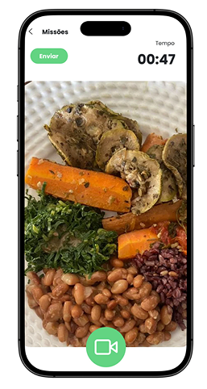

# EcoMovement

EcoMovement e uma plataforma de gamificacao sustentavel criada para o ecossistema SoulUp. A aplicacao transforma missoes e habitos sustentaveis em pontos, progresso e impacto coletivo.

## Tecnologias

- React 19
- Vite
- TypeScript
- React Router DOM
- React Hook Form
- Tailwind CSS v4
- React Icons

## Funcionalidades

- Home e pagina de apresentacao do projeto.
- Pagina Sobre com proposito, funcionamento, impacto e valores.
- FAQ com perguntas organizadas por categoria e respostas expansivas.
- Formulario de contato com validacao usando React Hook Form.
- Pagina de Integrantes com fotos, RM e links sociais.
- Pagina Solucao com galeria das telas do aplicativo.
- Pagina Missoes com fluxo passo a passo.
- Rotas estaticas e rota dinamica de integrante em /integrantes/:memberId.
- Layout compartilhado com Header, Footer e Outlet.

## Protótipo da solução

O EcoMovement incentiva ações sustentáveis por meio de missões. A jornada abaixo mostra como o usuário seleciona uma missão, registra sua evidência e confirma o envio para validação, e a finalização do ciclo com uma tela do sistema confirmando o envio.

  
  
  
  

  <em>Missões disponíveis · Registro de evidência · Envio confirmado</em>

## Como executar

Instale as dependencias:

bash
npm install

Inicie o servidor de desenvolvimento:

bash
npm run dev

Abra a URL exibida pelo Vite no navegador.

Para validar o projeto:

bash
npm run build
npm run lint

## Estrutura

text
src/
  assets/
  components/
    Button/
    Card/
    Footer/
    Header/
    Layout/
  Pages/
    Home/
    Inicio/
    Sobre/
    FAQ/
    Contato/
    Integrantes/
    Solucao/
    Missao/
  App.tsx
  index.css
  main.tsx

## Rotas

- / - Home
- /inicio - Inicio do EcoMovement
- /sobre - Sobre o projeto
- /faq - Perguntas frequentes
- /contato - Formulario de contato
- /integrantes - Equipe
- /integrantes/:memberId - Integrante selecionado
- /solucao - Solucao do projeto
- /missoes - Guia de missoes

## Integrantes

| Foto | Nome | RM | LinkedIn | GitHub | Turma |
|---|---|---|---|---|---|
|  | Guilherme Zanfolim Nunes Farias | RM 570983 | [LinkedIn](https://www.linkedin.com/in/guilherme-zanfolim-202865315?utm_source=share_via&utm_content=profile&utm_medium=member_ios) | [GitHub](https://github.com/zanfolim07) | 1TDSPV |

|  | Lucas Monteiro Dias da Costa | RM 571388 | [LinkedIn](https://www.linkedin.com/in/lucas-monteiro-1110703b5/) | [GitHub](https://github.com/monteiroo5) | 1TDSPV |

|  | Jaime Ringel | RM 562044 | [LinkedIn](https://www.linkedin.com/in/jaime-ringel-1060bb402?utm_source=share_via&utm_content=profile&utm_medium=member_android) | [GitHub](https://github.com/jaimeringel004) | 1TDSPV |

|  | Fabio Cezare Almeida | RM 572642 | [LinkedIn](https://www.linkedin.com/in/fabio-cezare-almeida-4b448a408?utm_source=share_via&utm_content=profile&utm_medium=member_ios) | [GitHub](https://github.com/FabioCAlmeida) | 1TDSPV |

|  | Matheus Magalhaes Romao de Moraes | RM 573371 | [LinkedIn](https://www.linkedin.com/in/matheus-magalh%C3%A3es-ti) | [GitHub](https://github.com/MagalhaesMatheus007) | 1TDSPV |

## Links

- [Repositório no GitHub](https://github.com/zanfolim07/EcoMovement-react)
- Vídeo no YouTube: em produção.

## Contato

Para dúvidas, sugestões ou informações sobre o projeto, utilize a [página de contato da aplicação](/contato) ou contate os integrantes pelos links apresentados acima.